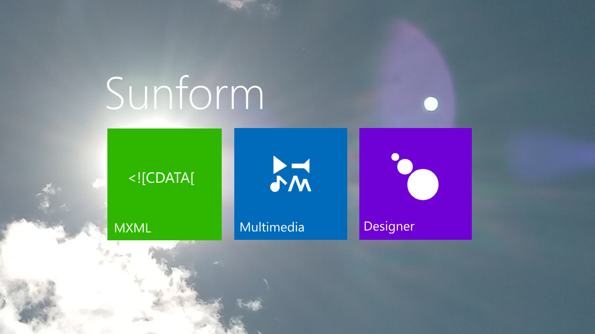

Sunform is a multimedia framework that supports ActionScript 3 as the main scripting language.

The Sunform SDK contains a MXML compiler that compiles ActionScript 3 and MXML. MXML files describe GUI components tied to an ActionScript 3 package.

* ASDoc is a tool used for generating HTML documentation from ActionScript 3 code.

The Sunform SDK contains a flexible package manager which the MXML compiler is oriented to, which is able to create, build, debug, test units, share and document projects through easy commands.

The Sunform API defines several closely-related programming interfaces, such as for 2D display objects, RGBA bitmap manipulations, 3D vertices-indices display capabilities, sound capabilities (speaker, microphone), geometry calculus and manipulations, network capabilities (HTTP, HTTPS, WS, WSS, FTP), fundamental programming interfaces, localization, internationalization, video capabilities (camera, screen), security capabilities (cryptography), system capabilities, desktop capabilities, mobile capabilities, touchscreen capabilities, keyboard capabilities, mouse capabilities, and utilities.

The Sunform Designer application enables creation of multimedia applications through an incorporated code editor and provides several interfaces such as for debugging and publishing an app.

## MXML compiler

The MXML compiler generates a WebAssembly module.

## Sunform implementation

Most of the Sunform SDK components are implemented in the Rust language, including the MXML compiler.

## WebAssembly runtime

The Sunform platform contains a WebAssembly runtime which evaluates the ActionScript 3 program.
